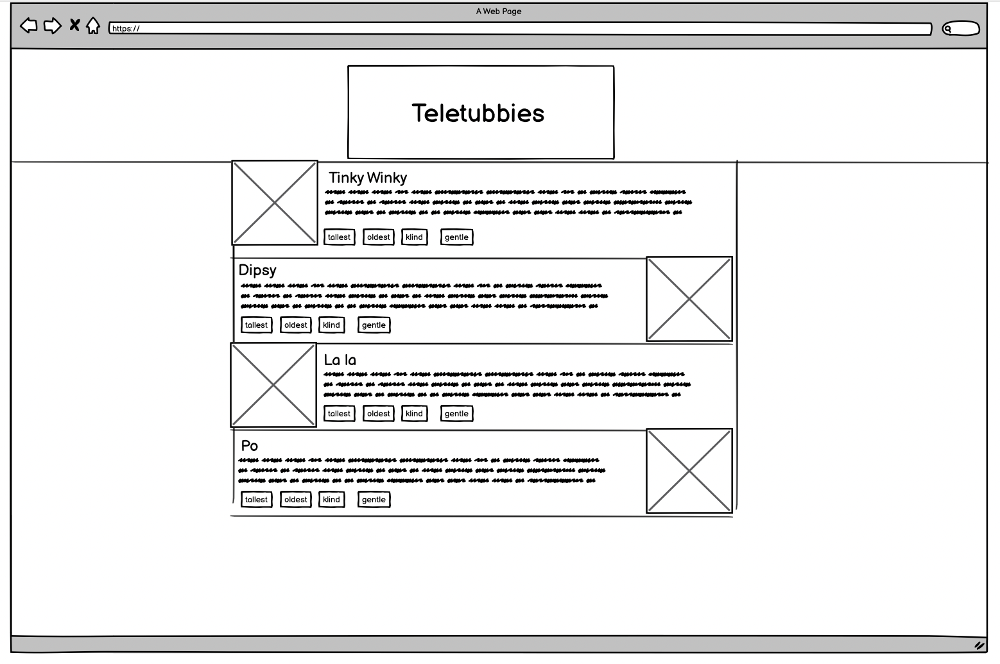

## Welcome to the Teletubbies Code Test!

This is a [Next.js](https://nextjs.org/) project bootstrapped with [`create-next-app`](https://github.com/vercel/next.js/tree/canary/packages/create-next-app) which contains a "CMS" called `NooNoo` and a partly scaffolded (it has a header) index page.

## Getting Started

First, run the development server:

```bash
npm run dev
# or
yarn dev
```

We need you to implement the following **static page** which is already in the repo as `./src/pages/index.tsx`:



We would like you to do this the NextJS way using TypeScript as much as possible, but not to use a NextJS API, you can just call `getAllTeletubbies()` as though it was a Headless CMS API call.

Also, like a lot of Headless CMSes that haven't got the autotyping working, the data is coming through untyped (as `any`), so we'd like you to create appropriate types. Good luck!

You can use any styling method you like, but Tailwind is already installed if you would like to use that.

You are allowed to Google as much as possible and also ask for help, it is more like a pair programming exercise than a proper code test. We just want to test drive working together!
